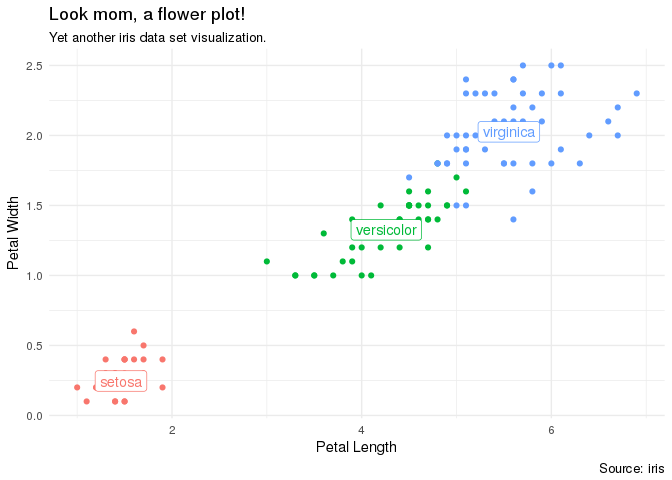
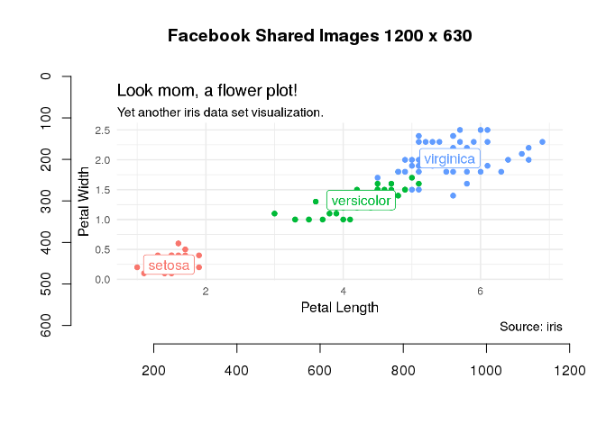
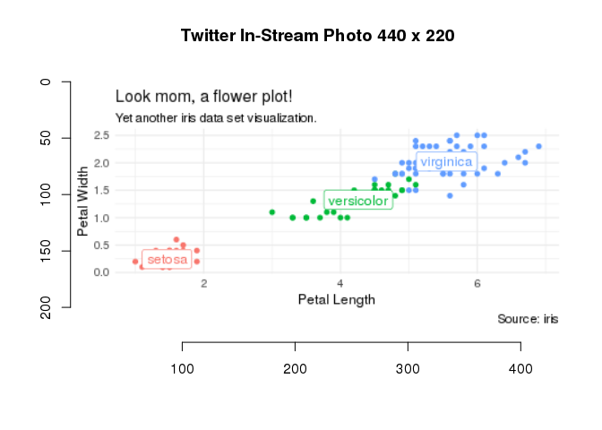

<!-- README.md is generated from README.Rmd. Please edit that file -->
smpic
=====

When you have created an awesome plot you want to share it with the world. But you want it to look just as awesome when you do as it looked in Rstudio on your local machine.

Enter `smpic`... This package helps you scale your awesome plots so they fit perfectly for whatever social media platform you want to share them on.

This is a walk though of how you do it...

First load the libraries:

``` r
library(dplyr)
library(ggplot2)
library(smpic)
```

The create a plot:

``` r
p <- ggplot(iris) +
  geom_point(aes(Petal.Length, Petal.Width, color = Species), show.legend = FALSE) +
  geom_label(data = summarise_if(group_by(iris, Species), is.numeric, mean),
             aes(Petal.Length, Petal.Width, label = Species, color = Species),
             show.legend = FALSE) +
  labs(x = "Petal Length", y = "Petal Width",
       title = "Look mom, a flower plot!",
       subtitle = "Yet another iris data set visualization.",
       caption = "Source: iris") +
  theme_minimal()
```

See the plot:

``` r
p
```



Play around with the `text_factor` to get your text just right.

Scale it for Facebook:

``` r
smpic_view(p, sm = "facebook_shared_images", text_factor = 2.2)
```



Scale it for Twitter:

``` r
smpic_view(p, sm = "twitter_in-stream_photo", text_factor = .8)
```


